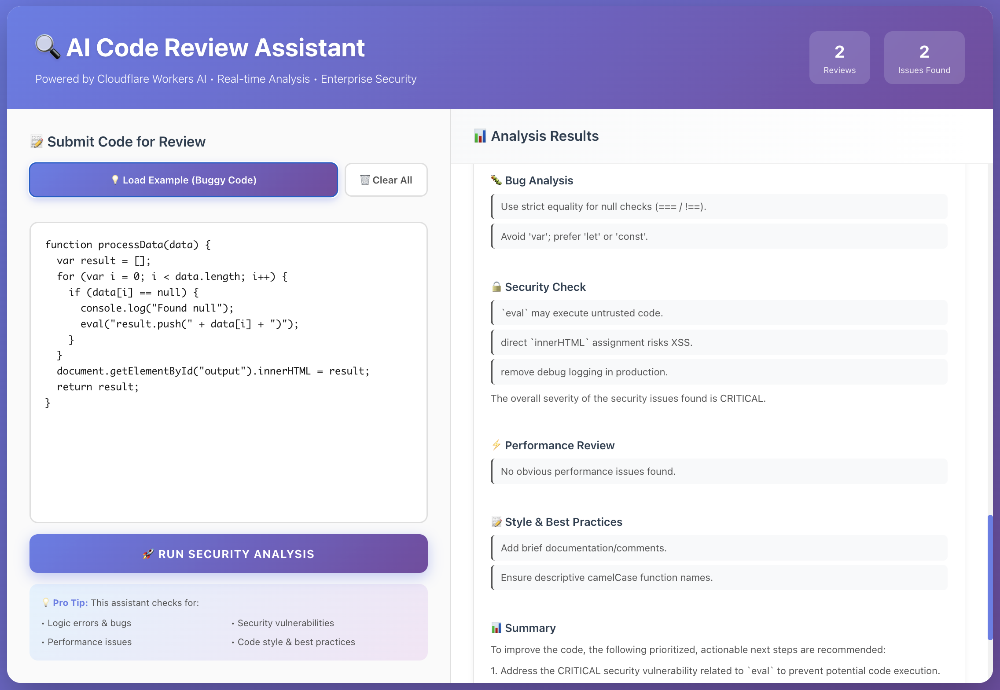

# 🔍 cf_ai_code_reviewer

An AI-powered code review assistant built on Cloudflare's edge infrastructure, providing real-time analysis of code for bugs, security vulnerabilities, performance issues, and style improvements using Llama 3.3 70B.

## ✨ Features

- 🤖 **Intelligent Code Analysis** - Multi-dimensional review using Llama 3.3 70B
- 🐛 **Bug Detection** - Identifies logic errors, null checks, and edge cases
- 🔒 **Security Scanning** - Detects XSS, SQL injection, eval usage, and sensitive data exposure
- ⚡ **Performance Review** - Finds inefficient patterns and optimization opportunities
- 📝 **Style Checking** - Enforces best practices and code conventions
- 💾 **Persistent Memory** - Session-based history using Durable Objects
- 🔍 **Semantic Search** - Vector-based code similarity search with Vectorize
- 🔄 **Real-time Streaming** - Live UI updates as analysis progresses
- 🔗 **GitHub Integration** - Automated PR reviews via webhooks (optional)
- 🎨 **Modern UI** - Responsive React interface with dark gradients

## 📸 Interface Preview



*Real-time code analysis showing bug detection, security vulnerabilities, performance issues, and style suggestions*

## 🏗️ Architecture


### Core Components

| Component | Technology | Purpose |
|-----------|-----------|---------|
| **LLM** | Llama 3.3 70B (Workers AI) | Code analysis and formatting |
| **Workflow** | Cloudflare Workers | Multi-step deterministic pipeline |
| **User Input** | React + TypeScript | Chat interface with code editor |
| **Memory/State** | Durable Objects | Session persistence |
| **Vector Search** | Vectorize | Semantic code search |
| **Embeddings** | BGE-small-en-v1.5 | 384-dim vectors for similarity |

### Analysis Pipeline

```
Code Input → [Bug Analysis] → [Security Check] → [Performance Review] → [Style Check]
    ↓
[Persist to DO] → [Embed & Index] → [LLM Formatting] → Streaming Response
```

## 📋 Prerequisites

- Node.js 18+ and npm
- Cloudflare account (free tier works)
- Wrangler CLI: `npm install -g wrangler`

## 🚀 Quick Start

### 1. Clone the Repository

```bash
git clone https://github.com/yourusername/cf_ai_code_reviewer.git
cd cf_ai_code_reviewer
```

### 2. Install Dependencies

```bash
npm install
```

### 3. Set Up Environment

Create `.dev.vars` file (optional, for local development):

```env
# Optional: for GitHub webhook integration
GITHUB_TOKEN=your_github_personal_access_token
GITHUB_WEBHOOK_SECRET=your_webhook_secret
```

### 4. Configure Wrangler

Create `wrangler.toml` in project root:

```toml
name = "cf-ai-code-reviewer"
main = "src/server.ts"
compatibility_date = "2024-01-01"

[ai]
binding = "AI"

[[durable_objects.bindings]]
name = "REVIEW_SESSIONS"
class_name = "ReviewSessionDO"
script_name = "cf-ai-code-reviewer"

[[migrations]]
tag = "v1"
new_classes = ["ReviewSessionDO"]

[[vectorize]]
binding = "VECTORIZE"
index_name = "code-reviews"
```

### 5. Create Vectorize Index

```bash
wrangler vectorize create code-reviews --dimensions=384 --metric=cosine
```

### 6. Run Locally

```bash
npm run dev
# or
wrangler dev
```

Visit `http://localhost:8787`

### 7. Deploy to Cloudflare

```bash
# Login first
wrangler login

# Deploy
npm run deploy
# or
wrangler deploy
```

Your app will be live at: `https://cf-ai-code-reviewer.<your-subdomain>.workers.dev`

## 📖 Usage

### Web Interface

1. Navigate to your deployed URL
2. Paste code into the left editor panel
3. Click **"Run Security Analysis"**
4. Review comprehensive analysis on the right panel

### Try the Example

Click **"Load Example (Buggy Code)"** to test with intentionally flawed JavaScript:

```javascript
function processData(data) {
  var result = [];
  for (var i = 0; i < data.length; i++) {
    if (data[i] == null) {
      console.log("Found null");
      eval("result.push(" + data[i] + ")");
    }
  }
  document.getElementById("output").innerHTML = result;
  return result;
}
```

**Expected findings:**
- 🐛 Use of `var` instead of `let`/`const`
- 🚨 **CRITICAL**: `eval()` security vulnerability
- ⚠️ **HIGH**: XSS risk with `innerHTML`
- ⚠️ Loose equality (`==`) instead of strict (`===`)

### API Endpoints

#### `POST /api/chat`
Main code review endpoint with streaming responses.

```bash
curl -X POST https://your-worker.workers.dev/api/chat \
  -H "Content-Type: application/json" \
  -d '{
    "messages": [
      {
        "role": "user",
        "content": "```javascript\nfunction test() { var x = 5; }\n```"
      }
    ]
  }'
```

#### `GET /api/history`
Retrieve session review history.

```bash
curl https://your-worker.workers.dev/api/history \
  -H "Cookie: sessionId=your-session-id"
```

#### `GET /api/search?q=<query>`
Semantic search across past reviews.

```bash
curl "https://your-worker.workers.dev/api/search?q=sql+injection" \
  -H "Cookie: sessionId=your-session-id"
```

#### `POST /api/webhook/github`
GitHub webhook endpoint for automated PR reviews (requires configuration).

## 🔧 Configuration

### Optional: GitHub Integration (Feature Available - Not Tested)

> ⚠️ **Note:** GitHub webhook integration is implemented but not tested for this submission. 
> The core chat interface works independently without any GitHub configuration.

Enable automated PR reviews (optional):

#### 1. Generate GitHub Token
- Go to GitHub Settings → Developer Settings → Personal Access Tokens
- Create token with `repo` scope
- Save the token

#### 2. Add Secrets to Cloudflare
```bash
echo "your-github-token" | wrangler secret put GITHUB_TOKEN
echo "your-webhook-secret" | wrangler secret put GITHUB_WEBHOOK_SECRET
```

#### 3. Configure Webhook in GitHub

- Go to repository → Settings → Webhooks → Add webhook
- **Payload URL**: `https://your-worker-url.workers.dev/api/webhook/github`
- **Content type**: `application/json`
- **Secret**: (same as `GITHUB_WEBHOOK_SECRET`)
- **Events**: Select "Pull requests"
- **Active**: ✓

#### 4. Test It

Open a PR and the bot should comment with a full code review.

### Environment Variables

Add to `wrangler.toml` under `[vars]` or use `wrangler secret put`:

| Variable | Type | Description |
|----------|------|-------------|
| `GITHUB_TOKEN` | Secret | GitHub personal access token |
| `GITHUB_WEBHOOK_SECRET` | Secret | Webhook verification secret |

### Bindings

| Binding | Type | Purpose |
|---------|------|---------|
| `AI` | Workers AI | LLM and embeddings |
| `REVIEW_SESSIONS` | Durable Objects | Session state |
| `VECTORIZE` | Vectorize | Semantic search |

## 🧪 Analysis Categories

### 🐛 Bug Analysis
- Logic errors and edge cases
- Null/undefined handling
- Variable scoping issues
- Type coercion problems
- Loop conditions

### 🔒 Security Check
- **CRITICAL**: Code injection (`eval`, `Function`)
- **HIGH**: XSS vulnerabilities (`innerHTML`, `outerHTML`)
- **HIGH**: SQL injection patterns
- **MEDIUM**: Sensitive data exposure
- **LOW**: Debug logging in production

### ⚡ Performance Review
- Algorithm complexity (nested loops)
- Redundant operations
- DOM query optimization
- Inefficient data structures
- String concatenation in loops

### 📝 Style & Best Practices
- Modern syntax (`let`/`const` vs `var`)
- Naming conventions
- Code documentation
- Indentation consistency
- Line length limits

## 📁 Project Structure

```
cf_ai_code_reviewer/
├── src/
│   ├── server.ts          # Main Worker + API routes + streaming
│   ├── review_session.ts  # Durable Object for session state
│   ├── tools.ts           # Analysis tools (bugs, security, perf, style)
│   └── app.tsx            # React chat interface
├── wrangler.toml          # Cloudflare configuration
├── package.json           # Dependencies and scripts
├── tsconfig.json          # TypeScript configuration
├── README.md              # This file
├── PROMPTS.md             # AI prompts used during development
└── .gitignore             # Git ignore rules
```

## 🛠️ Customization Guide

### Adding New Analysis Tools

Edit `src/tools.ts` to add new tools:

```typescript
export const checkAccessibility = tool({
  description: "Check for accessibility issues (ARIA, alt text, etc.)",
  parameters: z.object({
    code: z.string(),
    language: z.string().optional(),
  }),
  execute: async ({ code, language }) => {
    const issues: string[] = [];
    
    // Add your checks
    if (code.includes(") {
  const { analyzeBugs, checkSecurity, suggestPerformance, checkStyle, checkAccessibility } = tools;
  const [bugs, sec, perf, style, a11y] = await Promise.all([
    analyzeBugs.execute({ code }),
    checkSecurity.execute({ code }),
    suggestPerformance.execute({ code }),
    checkStyle.execute({ code }),
    checkAccessibility.execute({ code }),
  ]);
  return { bugs, sec, perf, style, a11y };
}
```

### Supporting More Languages

Extend `detectLanguage()` in `tools.ts`:

```typescript
function detectLanguage(code: string): string {
  if (code.includes("function") || code.includes("const")) return "javascript";
  if (code.includes("def ") || code.includes("import ")) return "python";
  if (code.includes("public class")) return "java";
  if (code.includes("fn ") || code.includes("let mut")) return "rust";
  if (code.includes("func ") && code.includes("package")) return "go";
  return "unknown";
}
```

### Customizing the UI

Edit `src/app.tsx`:

- **Theme colors**: Modify gradient backgrounds and color schemes
- **Layout**: Adjust flex ratios between editor and results panels
- **Message formatting**: Update `formatContent()` function
- **Stats tracking**: Add new metrics to the stats counter

## 🔍 Example Use Cases

### 1. Pre-commit Code Review
Paste code before committing to catch issues early

### 2. Learning Tool
Students can learn secure coding by seeing real-time feedback

### 3. Code Migration Assistant
Analyze legacy code and get modernization suggestions

### 4. Security Audit
Scan codebases for common vulnerabilities before deployment

### 5. Team Onboarding
New developers can check their code against team standards

## 💡 Future Enhancements

- [ ] Support for more languages (Go, Rust, TypeScript, C++)
- [ ] Inline code suggestions with diffs
- [ ] Custom rule configuration per project
- [ ] Team collaboration features
- [ ] VS Code extension integration
- [ ] Batch file analysis
- [ ] Export reports as PDF/Markdown
- [ ] Integration with CI/CD pipelines
- [ ] Severity filtering and prioritization

## 🤝 Contributing

This is a submission for Cloudflare's AI assignment. All work is original, with AI-assisted development documented in `PROMPTS.md`.

### Guidelines
- All code must be original
- Document AI assistance in `PROMPTS.md`
- Follow the existing code style
- Test thoroughly before submitting

## 📚 Learn More

- [Cloudflare Workers AI](https://developers.cloudflare.com/workers-ai/)
- [Durable Objects](https://developers.cloudflare.com/durable-objects/)
- [Vectorize Documentation](https://developers.cloudflare.com/vectorize/)
- [Vercel AI SDK](https://sdk.vercel.ai/docs/introduction)
- [Llama 3.3 Model Card](https://developers.cloudflare.com/workers-ai/models/llama-3.3-70b-instruct-fp8-fast/)

## 📄 License

MIT License - Feel free to use and modify for your own projects.

## 🙏 Acknowledgments

Built with:
- [Cloudflare Workers](https://workers.cloudflare.com/) - Edge compute platform
- [Workers AI](https://ai.cloudflare.com/) - Inference on Cloudflare's global network
- [Vercel AI SDK](https://sdk.vercel.ai/) - Unified interface for AI models
- [React](https://react.dev/) - UI framework
- [TypeScript](https://www.typescriptlang.org/) - Type safety

---

**Built with ❤️ on Cloudflare's edge network**

For issues or questions, please open an issue on GitHub.
